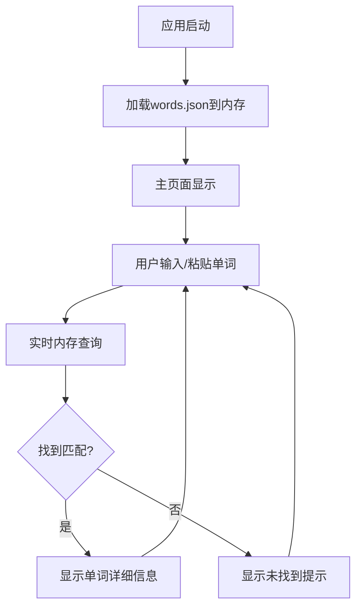

## 1. Product Overview
考研单词趣记法快速查询工具是一个轻量级、响应极速的纯前端Web应用，专为备战考研的中国大学生设计。
- 解决考研英语6000个单词死记硬背效率低下的痛点，提供谐音、联想、词根词缀等趣味记忆技巧的快速查询功能。
- 目标是成为考研学生在华为平板等设备上背单词时的高效辅助工具，通过复制粘贴即可获得单词的趣味记忆方法。

## 2. Core Features

### 2.1 User Roles
本应用无需用户注册和角色区分，所有功能对所有用户开放。

### 2.2 Feature Module
我们的考研单词查询工具包含以下核心页面：
1. **主页面**：搜索输入框、粘贴按钮、结果展示区域

### 2.3 Page Details

| Page Name | Module Name | Feature description |
|-----------|-------------|---------------------|
| 主页面 | 搜索输入框 | 支持实时输入查询，瞬时响应显示匹配结果 |
| 主页面 | 粘贴按钮 | 一键粘贴剪贴板内容到搜索框，提升查询效率 |
| 主页面 | 结果展示区域 | 结构化显示单词信息：单词、释义、记忆类型标签、趣味记忆法（核心突出显示）、例句翻译 |
| 主页面 | 数据加载模块 | 应用启动时一次性加载words.json到内存，后续查询基于内存数据 |
| 主页面 | 查询逻辑模块 | 基于内存数据进行精确匹配查找，无网络请求延迟 |

## 3. Core Process

用户操作流程：
1. 用户打开应用，系统自动加载words.json数据到内存
2. 用户在搜索框输入单词或点击粘贴按钮粘贴单词
3. 系统实时从内存中精确匹配查找单词
4. 找到匹配结果时显示完整单词信息，未找到时显示"未找到该单词"提示

## 4. User Interface Design

### 4.1 Design Style
- 主色调：清新蓝色(#3B82F6)作为主色，浅灰色(#F8FAFC)作为背景色
- 按钮样式：圆角按钮，悬停时有轻微阴影效果
- 字体：系统默认字体，搜索框16px，标题18px，内容14px
- 布局风格：极简卡片式布局，中央对齐设计
- 图标风格：简洁线条图标，粘贴按钮使用clipboard图标

### 4.2 Page Design Overview

| Page Name | Module Name | UI Elements |
|-----------|-------------|-------------|
| 主页面 | 搜索输入框 | 居中显示，宽度300px，圆角边框，placeholder提示"请输入要查询的单词"，字体16px |
| 主页面 | 粘贴按钮 | 搜索框右侧，蓝色背景，白色图标，圆角设计，悬停效果 |
| 主页面 | 结果展示区域 | 白色卡片背景，圆角阴影，单词标题加粗18px，记忆类型彩色标签，记忆内容突出显示黄色背景 |
| 主页面 | 页面标题 | 顶部居中，"考研单词趣记法查询工具"，字体20px，深灰色 |

### 4.3 Responsiveness
应用采用响应式设计，优先适配桌面端，同时兼容平板设备（特别是华为平板），支持触摸交互优化。