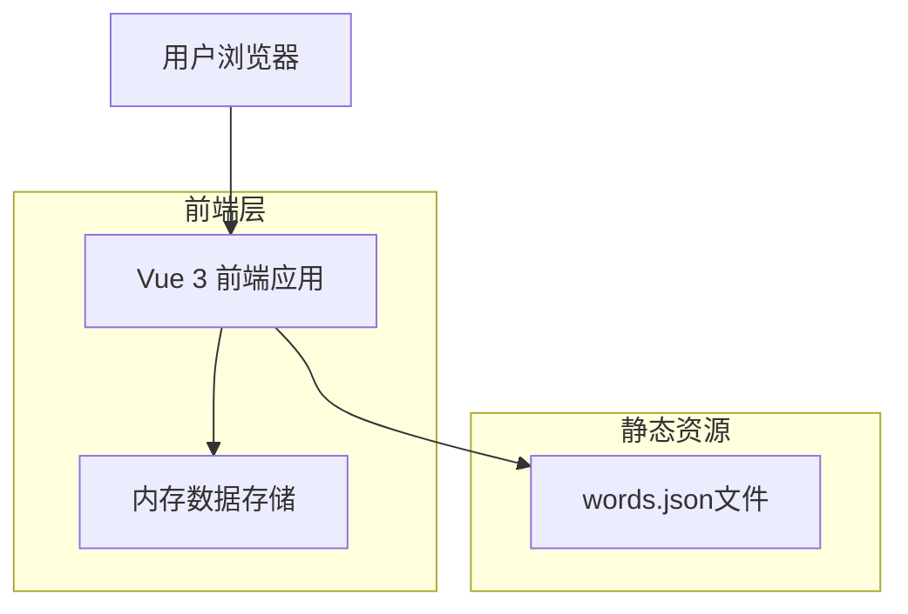
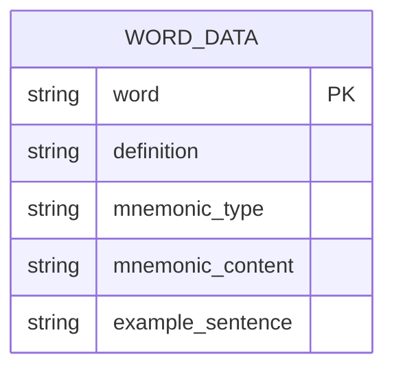

## 1. Architecture design



## 2. Technology Description

* Frontend: Vue\@3 + TypeScript + Vite + 原生CSS

* Backend: 无（纯前端静态应用）

* 数据存储: 本地JSON文件 + 内存缓存

## 3. Route definitions

| Route | Purpose              |
| ----- | -------------------- |
| /     | 主页面，包含搜索功能和结果展示的单页应用 |

## 4. API definitions

### 4.1 数据接口

本应用为纯前端应用，无传统API接口，主要数据交互为：

**数据加载**

```typescript
// 加载words.json数据
fetch('/words.json')
  .then(response => response.json())
  .then(data => WordData[])
```

**数据类型定义**

```typescript
interface WordData {
  word: string;           // 单词
  definition: string;     // 中文释义
  mnemonic_type: string;  // 记忆类型
  mnemonic_content: string; // 趣味记忆法内容
  example_sentence: string; // 例句及翻译
}

interface SearchResult {
  found: boolean;
  data?: WordData;
}
```

**核心方法定义**

```typescript
// 搜索方法
function searchWord(query: string): SearchResult

// 粘贴方法
function pasteFromClipboard(): Promise<string>

// 数据加载方法
function loadWordsData(): Promise<WordData[]>
```

## 5. 数据模型

### 5.1 Data model definition



### 5.2 Data Definition Language

**words.json 数据结构**

```json
[
  {
    "word": "abandon",
    "definition": "v. 放弃, 抛弃",
    "mnemonic_type": "词根词缀",
    "mnemonic_content": "词根 'a-' 表示 '离开'，'ban' 在古代有'禁令'的意思...所以 abandon 就是'因禁令而离开'，引申为【放弃】。",
    "example_sentence": "They had to abandon the sinking ship. 他们不得不弃船逃生。"
  },
  {
    "word": "sketch",
    "definition": "n. 素描, 梗概 v. 画素描, 概述",
    "mnemonic_type": "谐音联想",
    "mnemonic_content": "可以联想成'S'形的'ket'（看作'cat'猫）和'ch'（吃）...你把它优美的姿态快速画成了【素描】。",
    "example_sentence": "The artist made a quick sketch of the landscape. 这位艺术家飞快地画了一张风景素描。"
  }
]
```

**占位数据文件创建**

```bash
# 在public目录下创建words.json文件
# 包含上述示例数据，供开发测试使用
```

## 6. 项目结构

```
word-is-my-world/
├── public/
│   ├── words.json          # 单词数据文件
│   └── index.html
├── src/
│   ├── components/
│   │   ├── SearchBox.vue   # 搜索框组件
│   │   ├── PasteButton.vue # 粘贴按钮组件
│   │   └── ResultDisplay.vue # 结果展示组件
│   ├── composables/
│   │   ├── useWordSearch.ts # 搜索逻辑
│   │   └── useClipboard.ts  # 剪贴板操作
│   ├── types/
│   │   └── word.ts         # 类型定义
│   ├── App.vue             # 主应用组件
│   └── main.ts             # 应用入口
├── package.json
├── vite.config.ts
├── tsconfig.json
└── README.md
```

